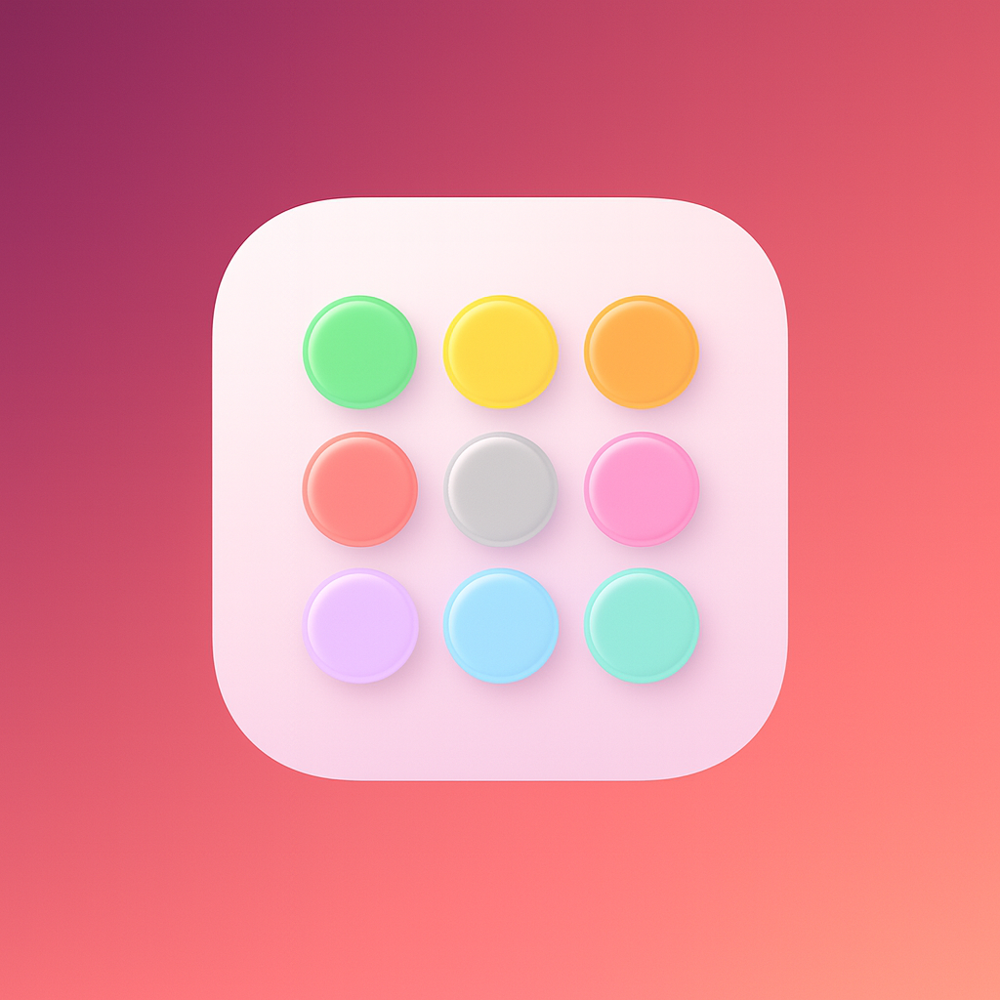
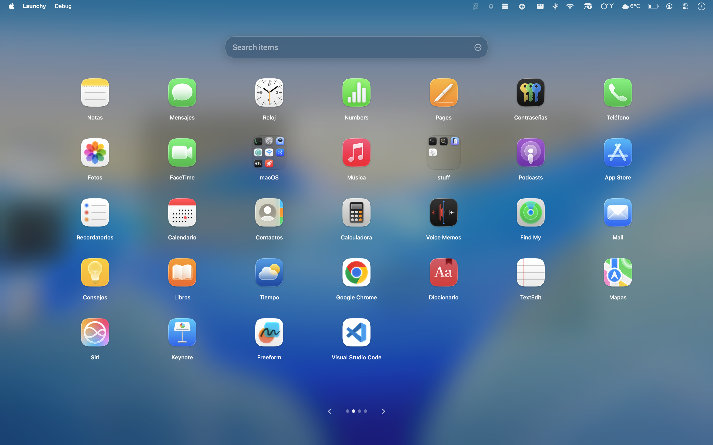

# Launchy

Launchy is the open-source Launchpad alternative macOS users have been waiting for. Fullscreen mode mirrors the classic Launchpad experience but adds richer controls, while Floaty Mode doubles as a HUD with fast toggles that match the new macOS design without changing the behavior you rely on. It scans your apps, caches icons, and keeps a responsive grid ready on every Space - a universal binary that runs natively on both Apple Silicon (M‑series) and Intel Macs, all completely free.

  
  
  
  

    

  

  

    
🇪🇸 🇮🇹 🇩🇪 🇫🇷 🇵🇹 🇺🇦 🇷🇺 🇵🇱 🇬🇷 🇳🇱 🇸🇪 🇨🇿 🇭🇺 🇪🇸 🇫🇮 🇮🇪 Europe (16)

    
🇪🇸 Español (España) 🇮🇹 Italiano 🇩🇪 Deutsch 🇫🇷 Français 🇵🇹 Português (Portugal) 🇺🇦 Українська 🇷🇺 Русский 🇵🇱 Polski 🇬🇷 Ελληνικά 🇳🇱 Nederlands 🇸🇪 Svenska 🇨🇿 Čeština 🇭🇺 Magyar 🇪🇸 Català 🇫🇮 Suomi 🇮🇪 Gaeilge

  

  

    
🇵🇭 🇮🇳 🇮🇩 🇻🇳 🇹🇷 🇨🇳 🇯🇵 🇰🇷 🇹🇭 🇧🇩 🇵🇰 🇮🇳 🇮🇳 🇲🇾 🇲🇲 Asia (15)

    
🇵🇭 Filipino / Tagalog 🇮🇳 हिन्दी 🇮🇩 Bahasa Indonesia 🇻🇳 Tiếng Việt 🇹🇷 Türkçe 🇨🇳 中文（简体） 🇯🇵 日本語 🇰🇷 한국어 (대한민국) 🇹🇭 ภาษาไทย 🇧🇩 বাংলা 🇵🇰 اُردُو 🇮🇳 தமிழ் 🇮🇳 తెలుగు 🇲🇾 Bahasa Melayu 🇲🇲 မြန်မာ

  

  

    
🇧🇷 🇲🇽 🇺🇸 Americas (3)

    
🇧🇷 Português (Brasil) 🇲🇽 Español (LatAm) 🇺🇸 English

  

  

    
🇦🇪 🇮🇷 🇹🇿 🇳🇬 🇪🇹 🇳🇬 Middle East & Africa (6)

    
🇦🇪 العربية (الفصحى الحديثة) 🇮🇷 فارسی 🇹🇿 Kiswahili 🇳🇬 Hausa 🇪🇹 አማርኛ 🇳🇬 Yorùbá

  

  Spanish ships in both 🇲🇽 LatAm and 🇪🇸 Spain variants - the Americas card highlights LatAm while Europe lists the Iberian pack.

  

## Highlights

- **Launchpad-level fullscreen** - A fluid, edge-to-edge canvas with blur or solid backgrounds plus right-click menus for fast sorting, folder creation, and precise arrangement.
- **Floaty mode & HUD toggle** - Lightweight palette for quick launches; flip between floaty and fullscreen with a shortcut without losing your layout.
- **Search-first launching** - Type to filter instantly; `Return` opens the top match, arrows move selection, and the grid stays responsive.
- **Fully featured grid** - Scans /Applications, /System/Applications, and optional ~/Applications, caches icons, and keeps 7x5 pages ready while respecting custom names and hidden items.
- **Context-aware controls** - Right click any tile, folder, Dock, or menu bar icon to rename, hide, move, add/remove folders, show in Finder, or reset gaps without switching views.
- **Hot corners & shortcuts** - Global toggle hotkey, optional layout-switch shortcut, plus a hot corner trigger if you prefer mouse-only activation.
- **Startup & presence controls** - Launch at login, hide or show Dock and menu bar icons independently, and keep a menu bar status item for updates and settings.
- **Universal & smooth** - Native speed on Apple Silicon and Intel (no Rosetta), with icon caching to keep things silky even on huge libraries.
- **Auto-updating & MIT licensed** - Every build will be notarized, and the project will remain open source and free forever.
- **Accessibility & localization** - VoiceOver labels, contrast-friendly visuals, and wide language coverage so more people can fly through their apps.

## Search that just works

- **Bilingual smart match** - Searches English and your system language at once; whichever name you remember just works.
- **Normalized substring matching** - Folds case/diacritics across names and bundle IDs, so `"cafe"` hits `"Café"` and `"face"` hits `"FaceTime"`.
- **Instant feedback** - Light debounce + cached metadata for live results; hit `Return` for the top hit or arrows to pick another without leaving the field.

## Gestures (touchpad or mouse)

- **Swipe left/right** anywhere on the HUD to change pages.
- **Scroll wheel** up/down for the same paging behavior (works on classic mouse wheels and Magic Mouse).
- **Smooth scrolling** accumulates movement; small flicks will still flip pages once they cross a threshold.
- **Tap the background** to close Launchy quickly.

## Keyboard shortcuts

- **Show / hide Launchy:** configurable in Settings - set it to `Shift` + `Space` for a comfortable, launchpad-style trigger; `Ctrl` + `X` is a solid alternative if that combo isn’t already taken.
- **Toggle fullscreen ⇄ floaty palette:** configurable in Settings (no default)
- **Launch search result:** `Return` fires the first match without leaving the search field
- **Page with arrows:** left/right arrows flip between pages
- **Open settings:** `Cmd` + `,`
- **Direct page jumps:** hold `Control` and tap a number key (1‑9 or `0` for page 10) to instantly switch pages while the launcher is visible
- **Hotkey options:** set hotkeys with letters, numbers, punctuation, arrows, function keys, keypad keys, and media keys (volume/brightness/playback), plus any combo of `Cmd`/`Option`/`Shift`/`Ctrl`. If a media key doesn’t trigger globally, our app may need Input Monitoring permission.

## Quick tips

- **Right-click any icon** for rename, move, hide, Finder reveal, or folder shortcuts.
- **Drag apps together while holding Shift or Option** as you release to create a folder or drop into one without disturbing the grid; or use right-click to place apps exactly where you want.
- **Floaty mode** keeps the quick palette feel; assign a hotkey to jump between fullscreen and HUD instantly instead of mouse-only taps.
- **Use the Visuals tab** to pick standard, light blur, transparent, or solid color backgrounds (with a color palette) and decide if icons auto-fill gaps.
- **Hidden Apps** tab lets you include ~/Applications, mute noisy tools, or pin hidden entries to the top for quick toggling.
- **Shortcuts tab** sets the launcher hotkey, fullscreen ⇄ floaty toggle, and hot corner; Launchy still opens even if both Dock and menu bar icons are hidden.
- **Reset the grid** from Settings when you want a clean slate - **custom names and hidden states stay intact** - and enable Launch at Login so it’s ready after a reboot.
- **Backups** manual export/restore in Settings plus quiet auto-backups (max every 48h on unchanged refresh) in `~/Library/Application Support/Launchy/AutoBackup` with the latest 14 kept.

## License & support

- **License:** MIT. Use it anywhere, just keep the notice.

[Website](https://launchy.space) (currently there's not much to see)

## Get Launchy

- <a href="https://github.com/Punshnut/macos-launchy/releases/latest">Download Launchy for free</a> and enjoy automatic updates.

## Roadmap

Here are a few improvements planned for upcoming releases:
- **Richer, but unobtrusive animations** - smoother transitions, user input interpretation and calmer motion across fullscreen and Floaty mode.
- **Plugin support** - support for feature extensions and visual overlays through plugins

[Donate (Ko-Fi)](https://ko-fi.com/janfeuerbacher)

Made with ❤️

## Star History

