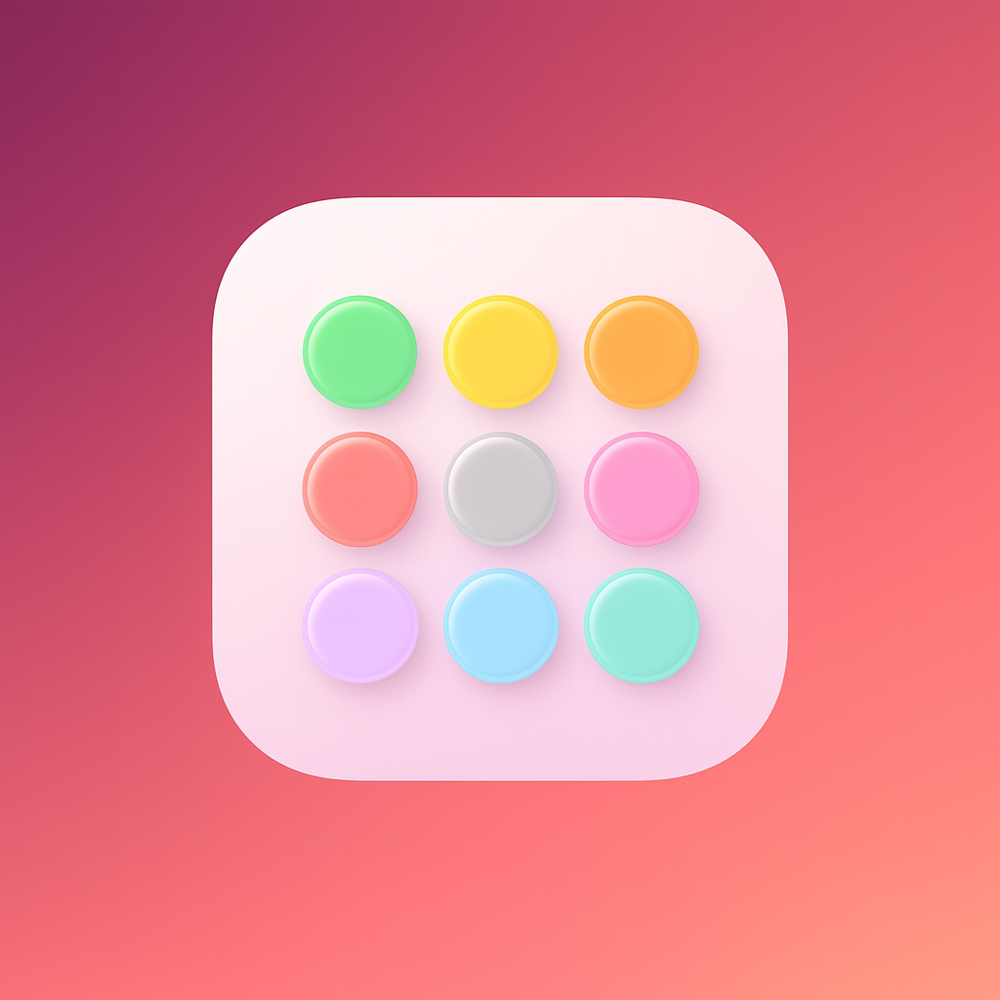
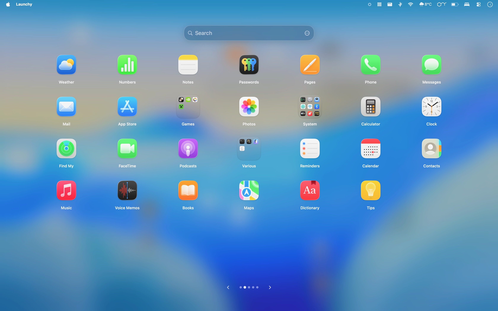

# Launchy Launchpad

Launchy Launchpad is the free open-source Launchpad alternative macOS users have been waiting for. Fullscreen mode mirrors the classic Launchpad experience but adds richer controls, while Floaty Mode doubles as a HUD with fast toggles that match the new macOS design without changing the behavior you rely on. 
It scans your apps, caches icons, and keeps a responsive grid ready on every Space - a universal binary that runs natively on both Apple Silicon (M-series) and Intel Macs.

  
  
  

    

  

  
<strong>ships with 40 languages built-in</strong>

  

    
🇪🇸 🇮🇹 🇩🇪 🇫🇷 🇵🇹 🇺🇦 🇷🇺 🇵🇱 🇬🇷 🇳🇱 🇸🇪 🇨🇿 🇭🇺 🇪🇸 🇫🇮 🇮🇪 Europe (16)

    
🇪🇸 Español (España) 🇮🇹 Italiano 🇩🇪 Deutsch 🇫🇷 Français 🇵🇹 Português (Portugal) 🇺🇦 Українська 🇷🇺 Русский 🇵🇱 Polski 🇬🇷 Ελληνικά 🇳🇱 Nederlands 🇸🇪 Svenska 🇨🇿 Čeština 🇭🇺 Magyar 🇪🇸 Català 🇫🇮 Suomi 🇮🇪 Gaeilge

  

  

    
🇵🇭 🇮🇳 🇮🇩 🇻🇳 🇹🇷 🇨🇳 🇯🇵 🇰🇷 🇹🇭 🇧🇩 🇵🇰 🇮🇳 🇮🇳 🇲🇾 🇲🇲 Asia (15)

    
🇵🇭 Filipino / Tagalog 🇮🇳 हिन्दी 🇮🇩 Bahasa Indonesia 🇻🇳 Tiếng Việt 🇹🇷 Türkçe 🇨🇳 中文（简体） 🇯🇵 日本語 🇰🇷 한국어 (대한민국) 🇹🇭 ภาษาไทย 🇧🇩 বাংলা 🇵🇰 اُردُو 🇮🇳 தமிழ் 🇮🇳 తెలుగు 🇲🇾 Bahasa Melayu 🇲🇲 မြန်မာ

  

    

    
🇦🇪 🇮🇷 🇹🇿 🇳🇬 🇪🇹 🇳🇬 Middle East & Africa (6)

    
🇦🇪 العربية (الفصحى الحديثة) 🇮🇷 فارسی 🇹🇿 Kiswahili 🇳🇬 Hausa 🇪🇹 አማርኛ 🇳🇬 Yorùbá

  

  

    
🇧🇷 🇲🇽 🇺🇸 Americas (3)

    
🇧🇷 Português (Brasil) 🇲🇽 Español (LatAm) 🇺🇸 English

  

 

  

## Highlights

- **Launchpad-level fullscreen** - A fluid, edge-to-edge canvas with blur or solid backgrounds plus right-click menus for fast sorting, folder creation, and precise arrangement.
- **Floaty mode & HUD toggle** - Lightweight palette for quick launches; flip between floaty and fullscreen with a shortcut without losing your layout.
- **Search-first launching** - Type to filter instantly; `Return` opens the top match, arrows move selection, and the grid stays responsive.
- **Fully featured grid** - Scans /Applications, /System/Applications, and optional ~/Applications, caches icons, and keeps 7x5 pages ready while respecting custom names and hidden items.
- **Context-aware controls** - Right click any tile, folder, Dock, or menu bar icon to rename, hide, move, add/remove folders, show in Finder, or reset gaps without switching views.
- **Hot corners & shortcuts** - Global toggle hotkey, optional layout-switch shortcut, plus a hot corner trigger if you prefer mouse-only activation.
- **Startup & presence controls** - Launch at login, hide or show Dock and menu bar icons independently, and keep a menu bar status item for updates and settings.
- **Universal & smooth** - Native speed on Apple Silicon and Intel (no Rosetta), with icon caching to keep things silky even on huge libraries.
- **Auto-updating & open source** - Every build will be notarized, and the project will remain open source and free forever.
- **Accessibility & localization** - VoiceOver labels, contrast-friendly visuals, and wide language coverage so more people can fly through their apps.

## Search that just works

Type a couple of letters and the grid filters live. Search is bilingual
(your name for an app in English or your system language both work),
forgiving of case and accents, and matches substrings anywhere in a name or
bundle ID, so `"cafe"` still finds `"Café"`. Press `Return` for the top hit
or arrow to another without leaving the field.

## Gestures and shortcuts

Page through your grid however feels natural: swipe or scroll with a
trackpad/mouse, or use the arrow keys. Everything else, opening Launchy,
toggling fullscreen and floaty mode, jumping straight to a page, is
keyboard-shortcut driven and fully configurable in Settings.

## Organizing your grid

Right-click any tile for rename, hide, move, or folder options. Hold
`Option` while dragging to build a folder, or hold `Shift` while dragging
to swap two tiles without reshuffling everything else. Hidden apps,
backups, and a clean-slate reset all live in Settings, and none of it
touches the custom names or hidden states you've already set up.

**Want the full walkthrough?** The [wiki](https://github.com/Punshnut/macos-launchy/wiki)
covers all of this as a proper user guide, with use cases and a tour of
every Settings tab, not just a feature list.

## License & support

- **License:** AGPL-3.0, effective 2026-09-11. Versions released before this date remain available under the original MIT license, which cannot be retroactively revoked; all new releases going forward are AGPL-3.0.

[Website](https://feuerbacher.me/projects/launchy) (currently there's not much to see)

## Get Launchy

- <a href="https://github.com/Punshnut/macos-launchy/releases/latest">Download Launchy for free</a> and enjoy automatic updates.

## Contributing

- **Build it yourself** - want to compile Launchy from source, test an unreleased change, or send a pull request? See [CONTRIBUTING.md](CONTRIBUTING.md) for a full walkthrough.
- **Using AI to contribute?** Read [AI_POLICY.md](AI_POLICY.md) first.

## Roadmap

Here are a few improvements planned for upcoming releases:
- **Richer, but unobtrusive animations** - smoother transitions, user input interpretation and calmer motion across fullscreen and Floaty mode.
- **Plugin support** - support for feature extensions and visual overlays through plugins

[Donate (Ko-Fi)](https://ko-fi.com/janfeuerbacher)

Made with ❤️

## Star History

